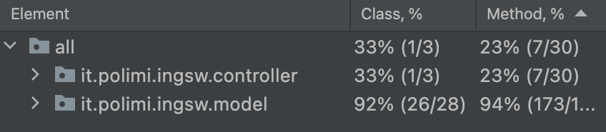

# Software Engineering Project 2022 


#

The project consists in the implementation of the Eriantys board game through a distributed system, consisting of a Server and several Clients that can connect to it via the network. Clients allow you to interact with the game via command line (CLI) or graphical interface (GUI).
## Documentation

### JavaDoc
A JavaDoc is available at the following index:
[JavDoc](link)

### UML
The following UML Diagrams were respectively developed during the planning phase of the project and after completion.

[Final Model UML](deliverables/UML/model_initialUML.jpg)     
[Final Server UML](deliverables/UML/Server_finalUML.jpg)    
[Final Controller UML](deliverables/UML/Controller_finalUML.jpg)

## Game modes
* Multiplayer mode
    * Play a multiplayer game (between 2 and 3 players)
    * Play a multiplayer game in teams (4 players)
* Standard mode
    * Play a game without the implementation of additional functions
* Expert mode
    * Play a game with the implementation of additional functions (coins and character cards)
  

## User Interfaces
* CLI
* GUI

## Advanced Functions

* Game for up to 4 players
* Multiple games
* 12 Character Cards (in Expert Mode)

## Executing program

### How to run the program

* The client can be executed by typing from the terminal the following command:
```
java -jar eriantys-client.jar
```
The user can then choose between the CLI and the GUI by simply typing their acronym.

Due to the presence of ANSI colors, the CLI can be correctly used in UNIX environments or in Windows 10 build 16257 (or later) with the ENABLE_VIRTUAL_TERMINAL_PROCESSING flag enabled.

### Server
The server can be executed by typing from the terminal the following command which starts the server on port 4000 and on the localhost:
```
java -jar eriantys-server.jar
```
If the user would like to set a different _port number_ and _ip address_, he can do so by typing the command with the following arguments:
```
java -jar eriantys-server.jar port_number ip_address
```
### Client
If the user would like to specify a different _port number_ and _ip address_, he can do so by typing the command with the following arguments:
```
java -jar eriantys-client.jar port_number ip_address
```

## Requirements
* jdk 15
* Resolution 1280x720 for the GUI 

### Add-ons
The different libraries and add-ons which were required during the development of this project are listed below:
- Maven
- JavaFX
- JUnit


## Dependencies
This project is written in Java/JavaFx and is built using Maven. Unit test are written using the Junit framework.
* JFX (Windows, Mac, Linux)

## Developed by:

* [Federico Vaona](https://github.com/Federicovaona)
* [Chiara Peruzzi](https://github.com/pchiara)
* [Tristan Van den Weghe](https://github.com/Trito99)

## Coverage view

* Only relevant methods have been tested
  


